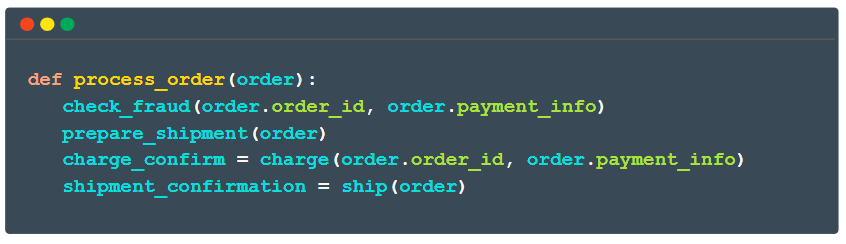

# Temporal Order Management Demo
This is a simple demo in Go that implements an order management system  in [Temporal](https://temporal.io/).

Here is our sample order process pseudocode:




This demo app demonstrates the [durability](https://temporal.io/how-it-works) of a process implemented in Temporal:
1. Crashing the process doesn't kill it. Upon resume it picks up right where it left off.
2. Errors are recovered without thought or work
3. At-Least-Once execution: activities succeed at least once per the workflow

Optionally, it can demonstrate how to [manage idempotence](./idempotence.md) in Temporal.

These capabilities are **great to develop with** and **change the way I think about doing development.** 


As a developer I can **focus** just on what I want to do, and Temporal manages what happens when things don't work out. 

While working on this project, I created **many** bugs in my activities, and all I had to do to fix my in-flight orders was fix the code bugs and restart the worker process. The  errors went away and none of the workflows failed, they all succeeded.

*Zero workflow processes failed in the building of this demo*.


## Process Order Concept
When a customer orders a product, the order is managed by executing the below steps, managed by Temporal.
 
This project utilises a workflow named [**"Process Order"**](./workflows/process_order.go), and this workflow invokes four activities:

 1. [Check for Fraud](./activities/check_fraud.go): validates that the payment info isn't fraudulent 
 2. [Prepare Shipment](./activities/prepare_shipment.go): validate there's enough stock and that the order isn't a duplicate
 3. [Charge](./activities/charge.go): charge for the order
 4. [Ship](./activities/ship.go): ship the order
 
 There is an extra step added to make sure there's enough inventory after the order:

 5. [Supplier Order](./activities/supplier_order.go). If the stock for the product drops below the minimum (5,000), an [order is placed with the supplier](./inventory/inventory.go) and the stock is updated.

These error-prone [Activities](https://docs.temporal.io/activities) are included in a [Workflow](https://docs.temporal.io/workflows) and executed in a [Worker](https://docs.temporal.io/workers), all built with the [Temporal SDK](https://docs.temporal.io/dev-guide):


The activities have random errors, just like real production applications. No matter the activity errors or worker crashes, Temporal ensures your application process completes as specified in the workflow. See the [demos](./demos.md) for ways to demonstrate and validate Temporal's retry capabilities and idempotency. 


## Process Results
The code in [starter](./starter/main.go) demonstrates the workflow. Initially, product 123456 has 1000 units. In the default behavior, a customer orders 999 units, and the supplier is requested to [deliver supply up to the minimum.](./inventory/inventory.go) After an order processes, you can see its results.

At the beginning, the database looks like this:

```json
{
    "orderID": "000",
    "productID": "123456",
    "inStock": 1000
}
```

As the order processes, the database looks like this:
```json
{
    "orderID": "A123",
    "productID": "123456",
    "inStock": 1
}
```

At the end the database looks like this:

```json
{
    "orderID": "A12",
    "productID": "123456",
    "inStock": 10000
}
```
The inventory was reduced by the order quantity of 999 and then set back up to the requested capacity.

No matter the activity errors, Temporal ensures that eventually this will be the state of things.

# Getting Started
See [Setup Instructions](./setup.md).
### First Demo
After the setup is done, you can do the  basic demo described in the [setup instructions](./setup.md). 
You can see an order get processed, maybe fail randomly.
1. Start the worker :
```shell
go run workers/main.go
```

2. Test with :
```shell 
go run starter/main.go
```

# Next Steps
1. Check out the ways to [demonstrate that this works nicely](./demos.md)
2. Play around with the code in new ways, try to break Temporal, maybe try some [retry policies](https://docs.temporal.io/retry-policies#:~:text=A%20Retry%20Policy%20works%20in,or%20an%20Activity%20Task%20Execution.) 
3. Feel free to fork and contribute!